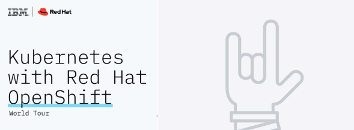

# IBM - Cloud Native Journey - Labs

This is a repository will have the lab links to get you started with Cloud Native learning journey.

Every week you will receive a new hands-on lab, which you will be expected to complete during the week before you receive details for the next hands-on lab. Links will be made live as we progress each week.

### Week 1 - Red Hat OpenShift on IBM Cloud - Part 1

- [Lab 1: RH OpenShift on IBM Cloud Part -1 ](https://developer.ibm.com/openlabs/guide/openshift/course/dte-roks-43-lab1/01.01)

[Lab environment setup](https://github.com/IBM-Developer-Advocacy-India/ibm-openshift-labs#how-to-setup-and-access-your-lab-environment)

### Week 2 - Red Hat OpenShift on IBM Cloud - Part 2

- [Lab 1: RH OpenShift on IBM Cloud Part - 2](https://developer.ibm.com/openlabs/guide/openshift/course/dte-roks-43-lab2/01.01)

[Lab environment setup](https://github.com/IBM-Developer-Advocacy-India/ibm-openshift-labs#how-to-setup-and-access-your-lab-environment)

### Week 3 - IBM Log Analysis with LogDNA and OpenShift

- [Lab 3: IBM LogDNA & OpenShift](https://developer.ibm.com/openlabs/guide/openshift/course/dte-roks-43-lab3/01.01)

[Lab environment setup](https://github.com/IBM-Developer-Advocacy-India/ibm-openshift-labs#how-to-setup-and-access-your-lab-environment)

### Week 4 - IBM Cloud Monitoring with Sysdig and OpenShift

- [Lab 4: IBM Sysdig and OpenShift](https://developer.ibm.com/openlabs/guide/openshift/course/dte-roks-43-lab4/01.01)

[Lab environment setup](https://github.com/IBM-Developer-Advocacy-India/ibm-openshift-labs#how-to-setup-and-access-your-lab-environment)

### How to setup and access your lab environment

Step 1: Open [IBM OpenShift Labs](https://developer.ibm.com/openlabs/openshift).

Step 2: Choose your desired lab that you want to work upon.
